# GitHub Contributor Intelligence Analyzer
FastAPI + Streamlit 기반으로 GitHub 저장소의 **커밋·이슈 텍스트를 수집**하고, 활동 히트맵 · 요약 · 토픽 모델링 · 클러스터링 · 생산성 예측까지 한 번에 수행하는 분석 도구입니다.

---

## 기능 요약
- **GitHub 데이터 수집**: REST API로 커밋/이슈/사용자 리포지토리 목록 조회. 토큰이 없어도 동작하지만, 토큰을 넣으면 rate limit 완화 및 안정적 수집.
- **활동 히트맵**: 날짜별 커밋 수를 캘린더 히트맵으로 시각화, streak/최대 활동일/요일별 패턴 통계 제공.
- **요약 / 클러스터링**: Ko/En 멀티링구얼 T5 요약, SentenceTransformer 임베딩 기반 의미 클러스터, TF-IDF 키워드 추출.
- **토픽 모델링**: Gensim LDA로 주요 토픽 추출, 휴리스틱 라벨링과 대표 예시 텍스트 제공.
- **생산성 추정**: 커밋/이슈/PR/코드 변경량을 회귀 모델에 넣어 MAE·R²·예측값·feature importance 제공.
- **Streamlit UI**: 리포지토리 선택/기간 설정, Overview · Heatmap · ML Lab 탭에서 결과 확인 및 실험 입력 폼 제공.

## 프로젝트 목적
- GitHub 기여 데이터에서 활동 패턴을 시각적으로 이해
- 커밋 메시지 자동 요약으로 레포지토리 이해도 향상
- 메시지 임베딩 기반 클러스터링으로 개발 작업 종류 분류
- LDA 토픽 모델링으로 프로젝트 핵심 주제 자동 추출
- 시계열 기반 커밋 생산성 예측으로 향후 활동량 예측
- Streamlit UI로 인터랙티브 분석 환경 제공

## 주요 기능 정리
1) GitHub Commit/Issue 자동 수집  
   - REST API로 실시간 데이터 가져오기  
   - 토큰 기반 인증 지원  
2) Contribution Heatmap  
   - GitHub 스타일 “잔디밭” 시각화  
   - 날짜별 commit 활동 강도 표시  
   - 활동 패턴 파악에 최적화  
3) Commit Message Summarization (NLP)  
   - mT5/BART 계열 요약 모델  
   - 커밋 메시지를 읽기 쉬운 문장으로 자동 요약  
4) Commit Embedding + Clustering  
   - SentenceTransformer(MiniLM/mpnet 등) 임베딩  
   - KMeans 클러스터링  
   - 개발 활동 종류 자동 분류(버그 수정/기능 추가/문서화 등)  
5) Topic Modeling (LDA)  
   - 커밋/이슈 텍스트에서 토픽 핵심 단어 추출  
   - 프로젝트 특징 자동 요약  
6) Productivity Prediction  
   - Linear Regression 기반  
   - 향후 활동량/점수를 예측하고 feature importance 제공  
7) Streamlit Dashboard UI  
   - 모든 분석을 한 화면에서 실행  
   - Heatmap / Summary / Topic / Predict 시각화  

---

## Why this project? (기존 GitHub UI와의 차별점)
GitHub 기본 UI도 Contribution graph와 Commit/Issue 리스트를 제공하지만, 이 프로젝트는 **“텍스트 내용” 중심 인사이트**를 강조합니다.
- 커밋/이슈 메시지를 요약해 “최근에 어떤 일을 했는지”를 빠르게 파악
- SentenceTransformer 임베딩으로 의미 기반 클러스터링 → 기능/버그/리팩토링 등 활동 패턴 분리
- LDA로 장기 작업 주제(테스트 정비, CI 설정, API 리팩터링 등) 자동 추출
- 커밋·이슈·PR·코드 변경량을 합쳐 생산성 회귀 예측 및 feature importance 설명
- 한 페이지(Overview/Heatmap/ML Lab)에서 **기록 → 분석 → ML 실험**을 끊김 없이 진행

즉, 단순히 “얼마나 자주 커밋했는가?”가 아니라, **“무슨 일을 했고, 어떤 패턴이 있고, 어떤 활동이 생산성에 영향을 주는가?”**를 분석합니다.

---

## 폴더 구조
```
backend/         # FastAPI 앱, 라우터(analyze/fetch/ml), 서비스, ML 유틸
frontend/        # Streamlit 대시보드(app.py)
.env             # 환경변수 예시(토큰/모델명) - 실제 토큰은 넣지 말 것
requirements.txt # 의존성
```

## Tech Stack
- Backend: FastAPI, Uvicorn
- Frontend: Streamlit
- Data: GitHub REST API, pandas, numpy
- ML/NLP: sentence-transformers, transformers, gensim (LDA), scikit-learn, torch
- Visualization: matplotlib, seaborn, Streamlit 컴포넌트

## Architecture Overview
- `backend/`
  - `main.py`: FastAPI 엔트리포인트, 라우터 등록
  - `routers/`: `fetch.py`(커밋/이슈/리포지토리), `analyze.py`(히트맵·클러스터·요약·토픽 묶음), `ml.py`(요약/클러스터/토픽/회귀)
  - `services/`: `github_service.py`(REST 래퍼), `preprocess_service.py`(텍스트 정제·히트맵 포인트), `ml_service.py`(클러스터·토픽·요약·회귀), `stats_service.py`(기여자 통계)
  - `ml/`: `clustering.py`, `summarizer.py`, `topic_modeling.py`, `prediction.py`
- `frontend/`
  - `app.py`: Streamlit UI(사이드바/탭/폼/그래프 렌더링)

---

## 빠른 시작
1) 의존성 설치 (Python 3.10+ 권장)
```bash
python -m venv .venv
.venv\Scripts\activate  # macOS/Linux: source .venv/bin/activate
pip install -r requirements.txt
```
2) 환경변수 설정 (.env 예시)
```
# GitHub API 토큰(선택이지만 권장, rate limit 완화)
GITHUB_TOKEN=ghp_your_token_here
# 문장 임베딩 모델(클러스터링)
CLUSTER_MODEL=all-mpnet-base-v2
# 요약 모델(ko/en 지원)
SUMMARIZER_MODEL=csebuetnlp/mT5_multilingual_XLSum
# Streamlit에서 백엔드 주소 지정
API_BASE=http://127.0.0.1:8000
```
- GPU가 있으면 torch/transformers가 자동 활용(없어도 CPU로 동작).
- GPU 실행시 CUDA 지원 버전 pytorch 설치 
      (pip install torch torchvision torchaudio --index-url https://download.pytorch.org/whl/cu121)

3) 백엔드 실행 (FastAPI)
```bash
uvicorn backend.main:app --host 0.0.0.0 --port 8000 --reload
```
4) 프론트엔드 실행 (Streamlit)
```bash
streamlit run frontend/app.py
```
- `API_BASE`를 읽어 백엔드에 요청합니다.

---

## 주요 API
- `POST /fetch/commits` / `POST /fetch/issues` → 리포지토리 커밋/이슈 원본 리스트
- `GET  /fetch/user/{username}/repos` → 사용자의 공개 리포지토리 목록
- `POST /analyze/overview` → 커밋/이슈 수집 → 히트맵 + 클러스터 + 요약 + 토픽
- `POST /analyze/heatmap` → 커밋 데이터만 받아 히트맵 포인트/통계 반환
- `POST /ml/summarize` → 자유 텍스트 요약
- `POST /ml/cluster` → 문서 의미 클러스터링 (k 지정/자동)
- `POST /ml/topics` → 문서 토픽 모델링 (LDA, 자동/수동 토픽 수)
- `POST /ml/predictivity` → 활동 통계 → 회귀 예측 + MAE + R² + feature importance

요청 공통 페이로드 예시:
```json
{
  "owner": "pallets",
  "repo": "flask",
  "since": "2024-09-01T00:00:00Z",
  "until": "2024-12-01T23:59:59Z"
}
```

## UI 사용 흐름 (Streamlit)
- 사이드바: GitHub 사용자명 입력 후 공개 리포지토리 목록 불러오기 → 기간 설정 → “분석 실행”.
- 개요 탭: 커밋/이슈 카운트, 의미 클러스터 요약, 토픽 모델 결과, 전체 요약 텍스트.
- 활동 히트맵 탭: 날짜별 커밋 히트맵, streak/최대 활동일/요일별 패턴 요약, 원본 테이블.
- ML 실험실 탭:  
  - Summarize: 텍스트 요약  
  - Cluster: 여러 문서 입력 → k 자동/수동 클러스터링  
  - Topics: 문서 모음 → LDA 토픽  
  - Predictivity: 활동 통계 테이블 편집 → 회귀 결과/feature importance 시각화

---

## Limitations & Future Work
- 짧은 기간/작은 리포지토리는 텍스트가 부족해 요약/토픽 모델 결과가 단순할 수 있음.
- 토픽 라벨은 키워드 휴리스틱 기반이므로, 추후 LLM 기반 라벨링으로 개선 여지.
- 회귀 기반 생산성 추정은 데이터가 적을 때 overfitting 가능성 → 더 많은 리포지토리/기간 데이터 확보 필요.
- GitHub API rate limit 및 모델 로딩 시간 때문에 최초 분석이 오래 걸릴 수 있음(CPU에서 특히).
- 향후 확장 아이디어: 다중 리포지토리/조직 단위 분석, PR 리뷰 코멘트 분석, 사용자별 월간/분기별 토픽 변화 시각화.

## Known Issues / Troubleshooting
- **모델 로딩 시간이 길다**: 최초 실행 시 Hugging Face 모델 다운로드로 수 분 소요. 이후 캐시 사용.
- **요약/클러스터링이 느리다**: CPU 환경에서 대형 모델 사용 시 지연 가능. `CLUSTER_MODEL`, `SUMMARIZER_MODEL`을 더 가볍게 하거나 기간을 줄여 텍스트 양 감소.
- **GitHub API rate limit**: `.env`에 `GITHUB_TOKEN`을 설정해 요청 한도를 늘림

## Demo & Screenshots

### Web
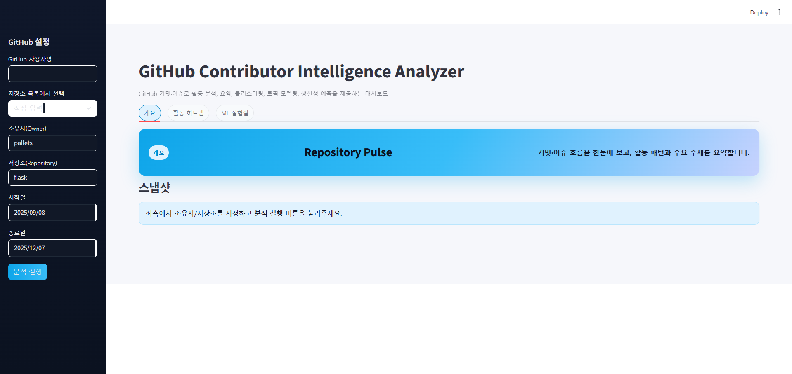

### Fetch repository
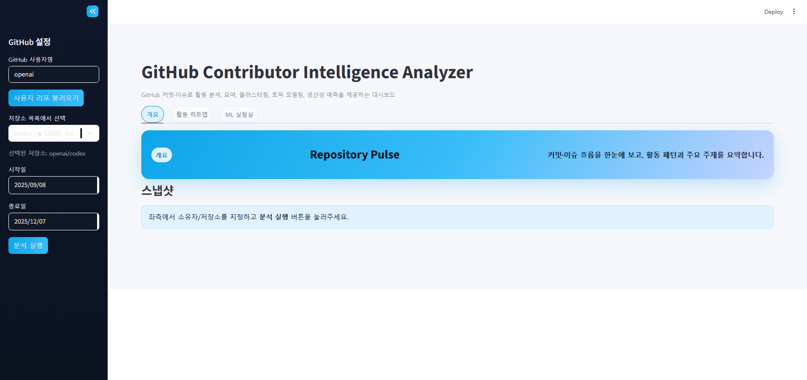

### Overview
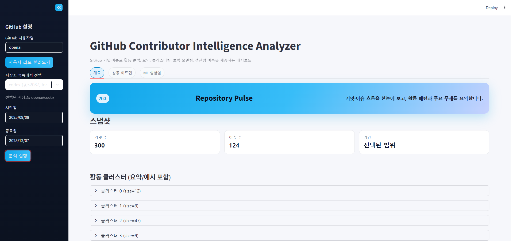

### Clustering
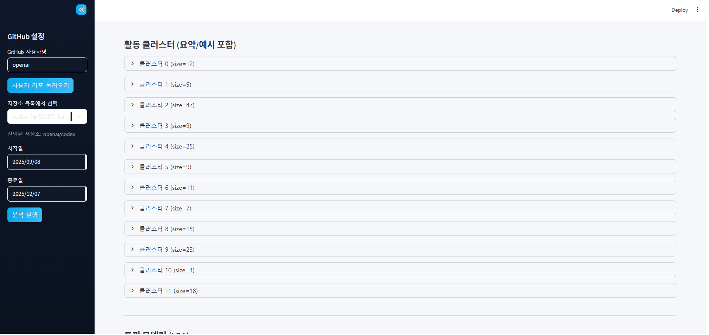


### Topic modeling
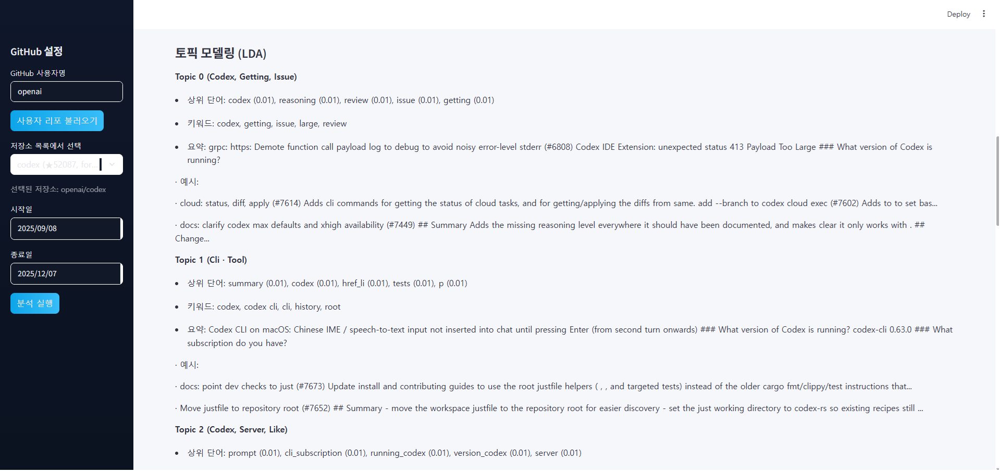

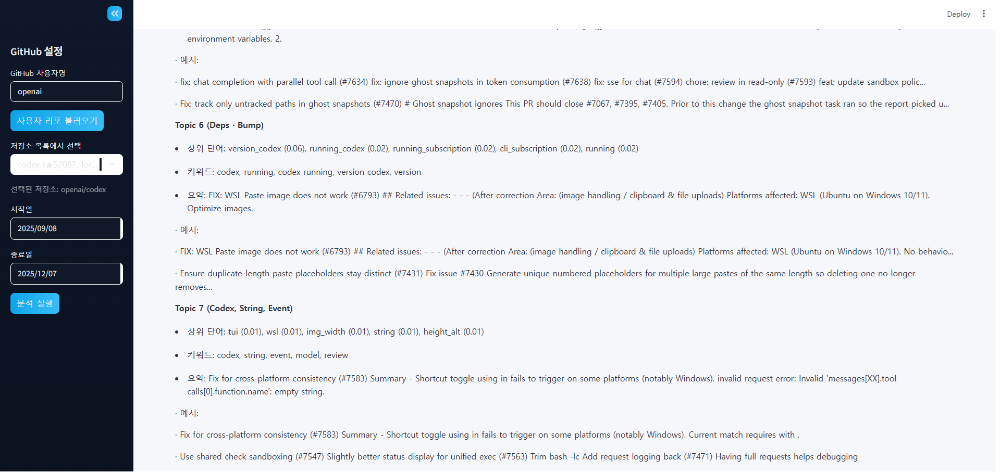

### Heatmap
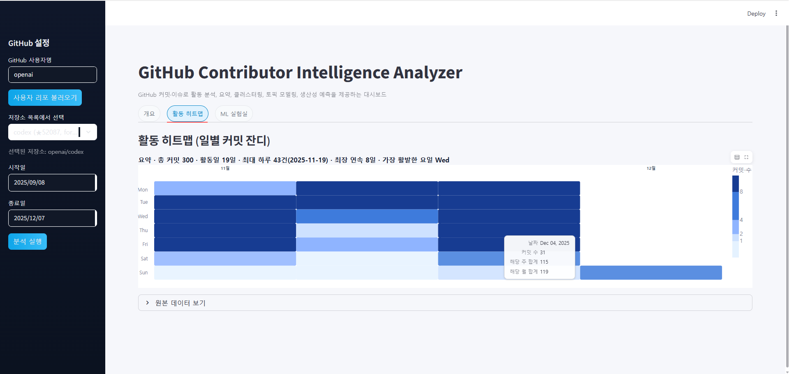


### ML Lab


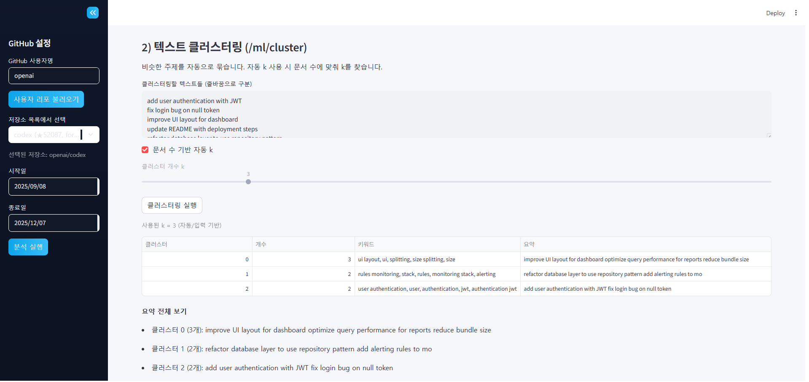

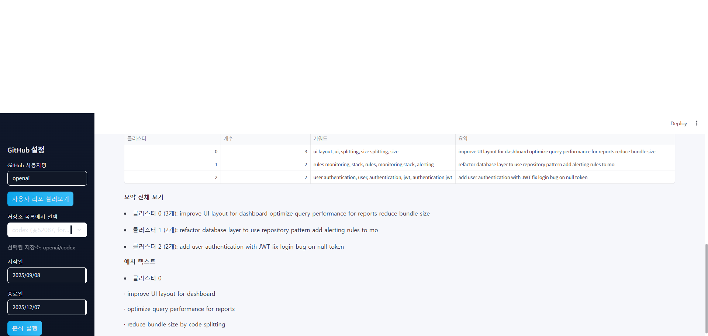

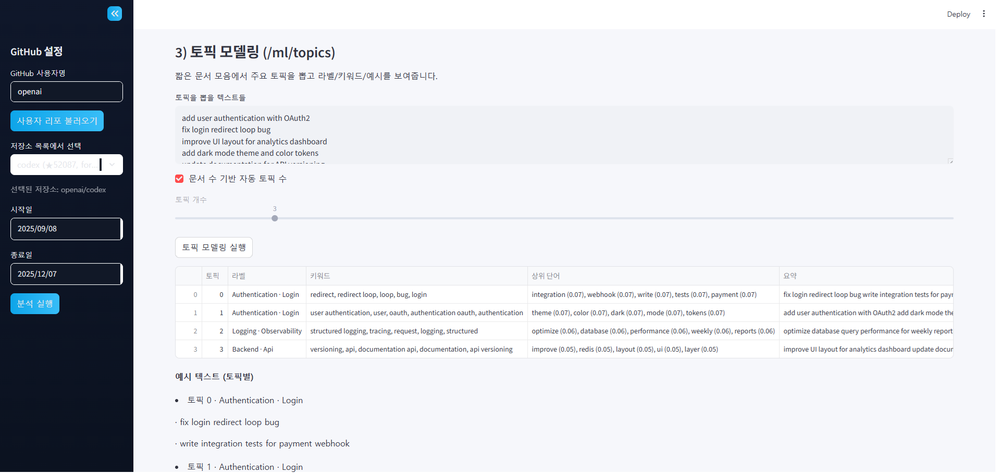

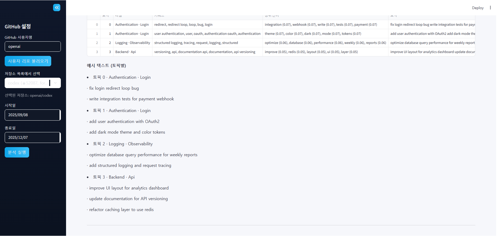

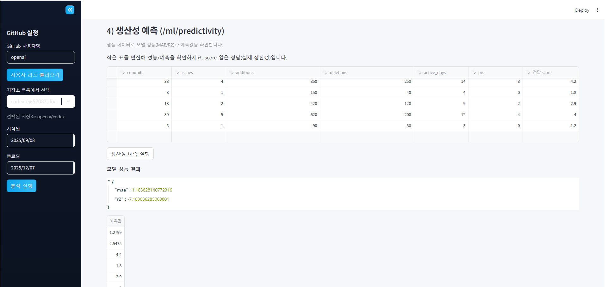

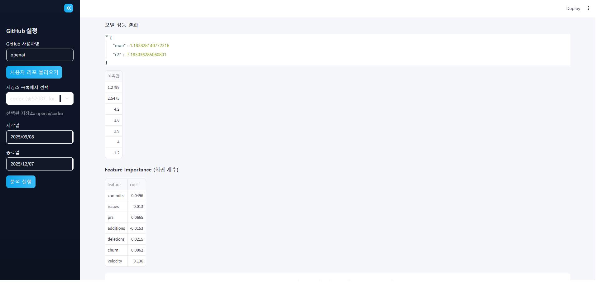

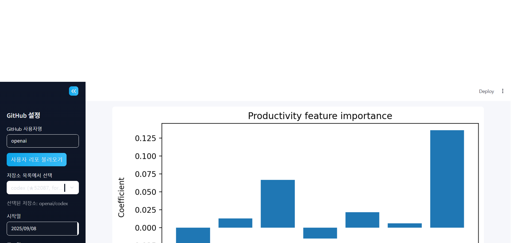


## Credits & References
- Sentence Embeddings: sentence-transformers  
- Summarization Model: csebuetnlp/mT5_multilingual_XLSum (Hugging Face)  
- Topic Modeling: gensim LDA  
- Backend Framework: FastAPI  
- Dashboard: Streamlit  

## 사용 라이선스(출처)
- FastAPI (MIT) — https://github.com/fastapi/fastapi/blob/master/LICENSE  
- Uvicorn (BSD-3-Clause) — https://github.com/encode/uvicorn/blob/master/LICENSE.md  
- Requests (Apache-2.0) — https://github.com/psf/requests/blob/main/LICENSE  
- python-dotenv (MIT) — https://github.com/theskumar/python-dotenv/blob/master/LICENSE  
- pydantic-settings (MIT) — https://github.com/pydantic/pydantic-settings/blob/main/LICENSE  
- pandas (BSD-3-Clause) — https://github.com/pandas-dev/pandas/blob/main/LICENSE  
- numpy (BSD-3-Clause) — https://github.com/numpy/numpy/blob/main/LICENSE.txt  
- scipy (BSD-3-Clause) — https://github.com/scipy/scipy/blob/main/LICENSE.txt  
- matplotlib (PSF/BSD-3-Clause) — https://github.com/matplotlib/matplotlib/blob/main/LICENSE/LICENSE  
- seaborn (BSD-3-Clause) — https://github.com/mwaskom/seaborn/blob/master/LICENSE  
- scikit-learn (BSD-3-Clause) — https://github.com/scikit-learn/scikit-learn/blob/main/COPYING  
- transformers (Apache-2.0) — https://github.com/huggingface/transformers/blob/main/LICENSE  
- sentence-transformers (Apache-2.0) — https://github.com/UKPLab/sentence-transformers/blob/master/LICENSE  
- torch (BSD-style) — https://github.com/pytorch/pytorch/blob/main/LICENSE  
- gensim (LGPL-2.1) — https://github.com/RaRe-Technologies/gensim/blob/develop/LICENSE  
- sentencepiece (Apache-2.0) — https://github.com/google/sentencepiece/blob/master/LICENSE  
- streamlit (Apache-2.0) — https://github.com/streamlit/streamlit/blob/develop/LICENSE  
- 요약 모델: 'csebuetnlp/mT5_multilingual_XLSum' (CC BY-NC-SA 4.0)
- 클러스터링 모델: 'all-mpnet-base-v2' (Apache-2.0)

## 프로젝트 라이선스
MIT
